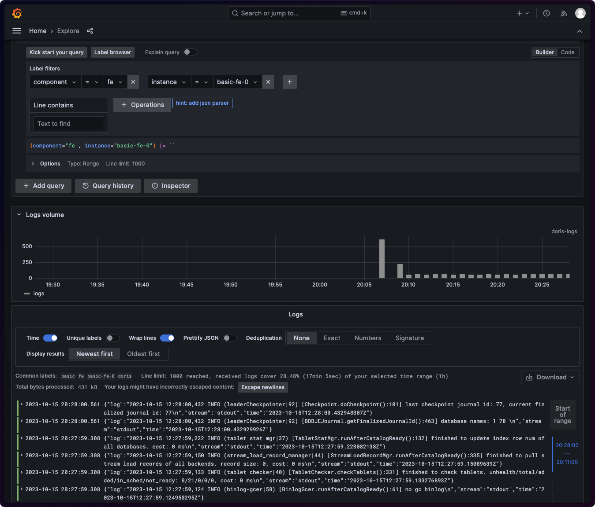
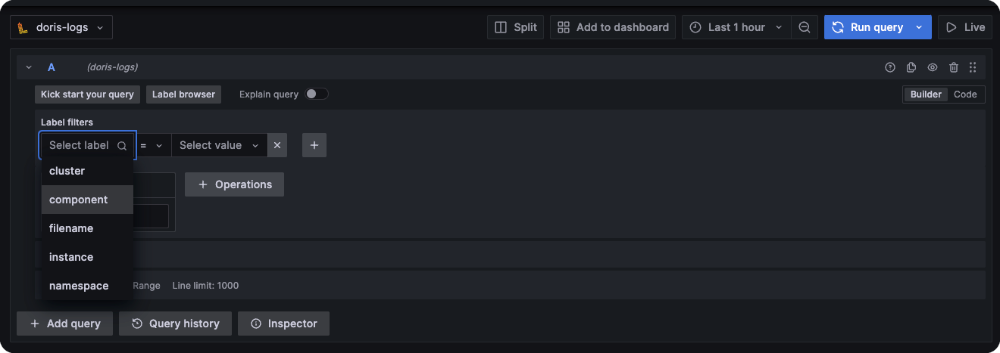
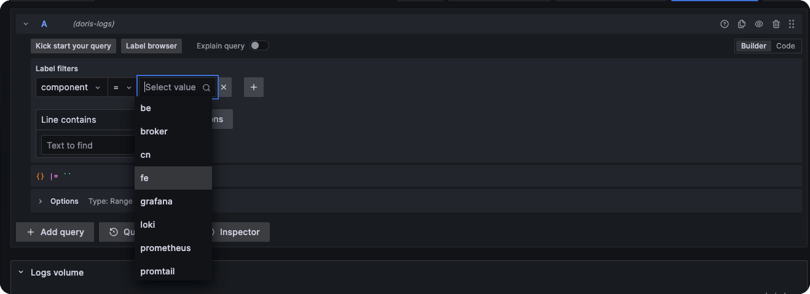

Doris Operator automatically collects logs from all Doris cluster components into Loki when DorisMonitor is deployed.
You can directly search these logs in Grafana.

## Go to Logs Queries UI

## LogQL

LogQL is used in Loki for querying logs. For more information on using LogQL, please refer to Loki Log queries.

## Quick Filtering of Doris Component Logs

If you're not familiar with LogQL, you can conveniently filter Doris component logs through Grafana's interactive
interface.

Here's a demonstration of how to filter logs for a specific Doris FE component instance "basic-fe-0":

1. Select the label "component":
   
2. Choose the target Doris component, in this case, select "fe":
   
3. Click "+" to add a new filter.
   
4. Select the label "instance":
   
5. Choose the Pod instance of the target component:
   
6. Click "Run query" to get the log results.
   

Through Grafana Loki, you can easily perform actions like querying all component error logs and keyword searches without
having to manually run "kubectl logs" on each pod.