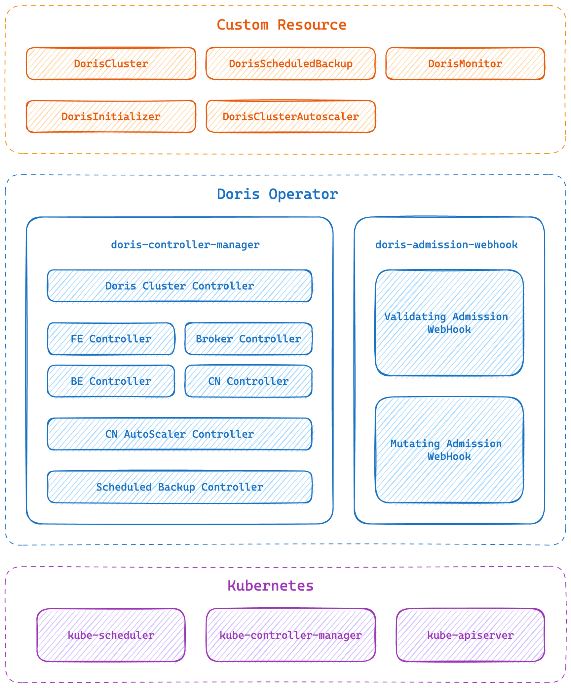
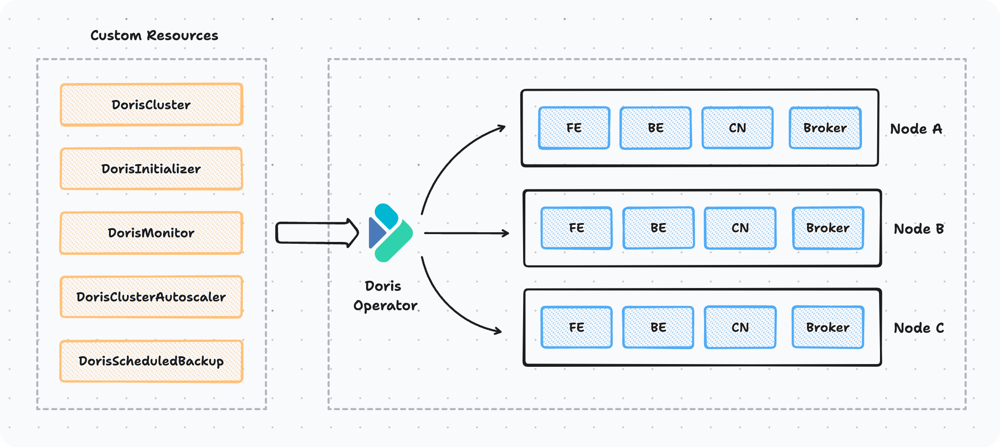

本文档介绍 Doris Operator 的架构及其工作原理。

## 架构

其中 `DorisCluster`、`DorisInitializer`、`DorisMonitor`、`DorisClusterAutoscaler`是由 CRD 定义的自定义资源：

- `DorisCluster` 用于描述用户期望的 Doris 集群；
- `DorisMonitor` 用于描述用户期望的 Doris 监控组件；
- `DorisInitializer` 用于描述用户期望的 Doris 集群初始化任务（初始密码、SQL脚本）；
- `DorisClusterAutoscaler` 用于描述用户期望的 Doris 集群自动扩缩容行为；

Doris 集群的编排和调度逻辑由以下组件负责：

- `doris-controller-manger` 是一组 Kubernetes 上的自定义控制器，这些控制控制器会不断对比 `DorisCluster` 对象记录的期望状态与
  Doris 集群的实际状态，并调整 Doris 中的资源以驱动 Doris 集群满足期望状态，同时根据其他 CR 完成相应的控制逻辑。
- `doris-admission-webhook` 是一个 Kubernetes 动态准入控制器，完成 Pod、Statefulset、Service 等相关资源的修改、验证和运维操作。

## 控制流程

Doris 集群、监控、初始化、备份等组件都过通过 CR 进行部署、管理，基本的控制流程如下：

- 用户通过 kubectl 创建 `DorisCluster` 和其他期望 CR 对象；
- Doris Operator 监听 `DorisCluster` 以及其他相关对象，基于集群的实际状态不断调整 FE、BE、CN、Broker
  或其他组件的 `StatefulSet`、`Deplotment`、`Service` 等对象资源；
- Kubernetes 原生控制器根据 `StatefulSet`、`Deplotment`、`Service` 等对象创建、更新或删除对应子资源的 `Pod`；

基于上述的声明式控制流程，Doris Operator 能够自动地进行集群节点健康检查和故障恢复。
