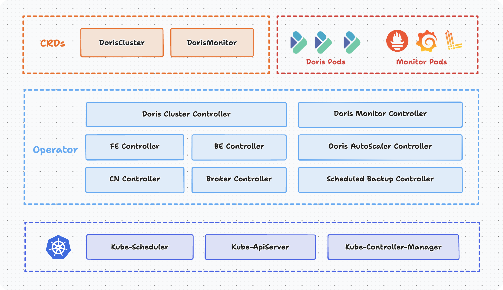

The Doris Operator is designed to streamlines the management of [Apache Doris](https://github.com/apache/doris) clusters
on [Kubernetes](https://kubernetes.io/), automating operational tasks and monitoring of the Doris cluster, with the
primary goal of transforming Doris into a truly **cloud-native** database.

## Version Requirement

- Kubernetes: 1.16+
- Apache Doris: 2.0.0+

## Features

The Doris Operator encompasses the following key features:

- **Kubernetes Package Management Support**

  Doris Operator supports installation via [Helm](https://helm.sh/) or [Kustomize](https://kustomize.io/), enabling easy
  deployment with a single command.

- **Rolling Updates for Doris Cluster**

  Orchestrates a smooth rolling update for the Doris cluster, allowing for non-disruptive configuration updates and
  version upgrades.

- **Secure Scalability of Doris Cluster**

  The Doris Operator facilitates horizontal scalability for Doris in the cloud, ensuring a secure and efficient scaling
  process.

- **Automated Compute Node Scaling Based on Load**

  Automatically adjusts the cluster's compute nodes based on the Doris load, optimizing performance through horizontal
  scaling.

- **Automatic Failover**

  In case of cluster failures, the Doris Operator seamlessly initiates automatic failover procedures to ensure
  uninterrupted service.

- **Automatic Monitoring Setup Upon Creation of Doris Cluster**

  Automatically deploys monitoring components such as [Prometheus](https://prometheus.io/)
  and [Grafana](https://grafana.com/) for monitoring, as well as [Loki](https://grafana.com/oss/loki/) for logging, to
  maintain the observability of the Doris cluster.

- **Automatic Data Backup (WIP)**

  Provides a user-friendly and customizable periodic data backup mechanism with automatic retry capabilities.

- **Multi-tenancy Support**

  Allows users to effortlessly deploy and manage multiple Doris clusters on a single Kubernetes cluster, promoting
  efficient multi-tenant utilization.
